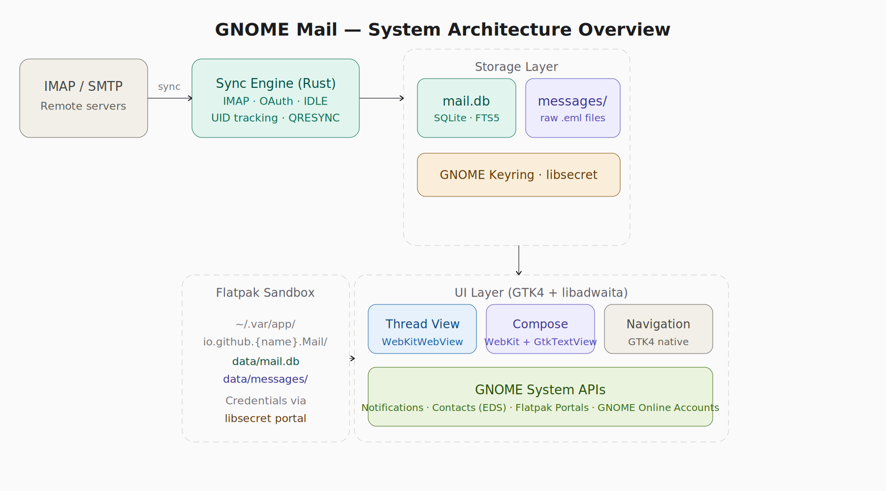
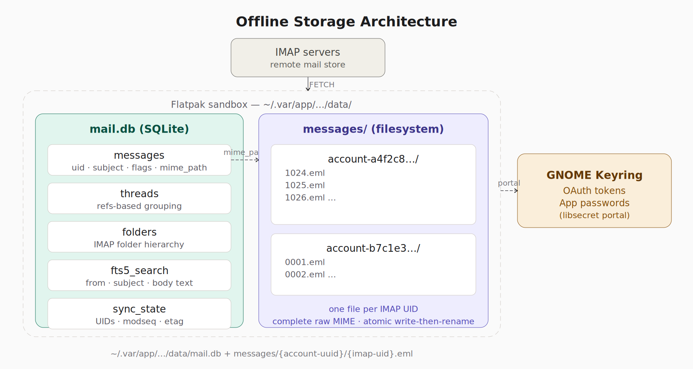
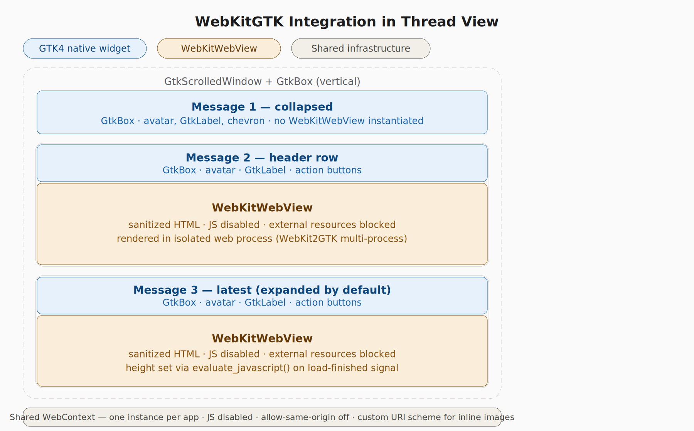
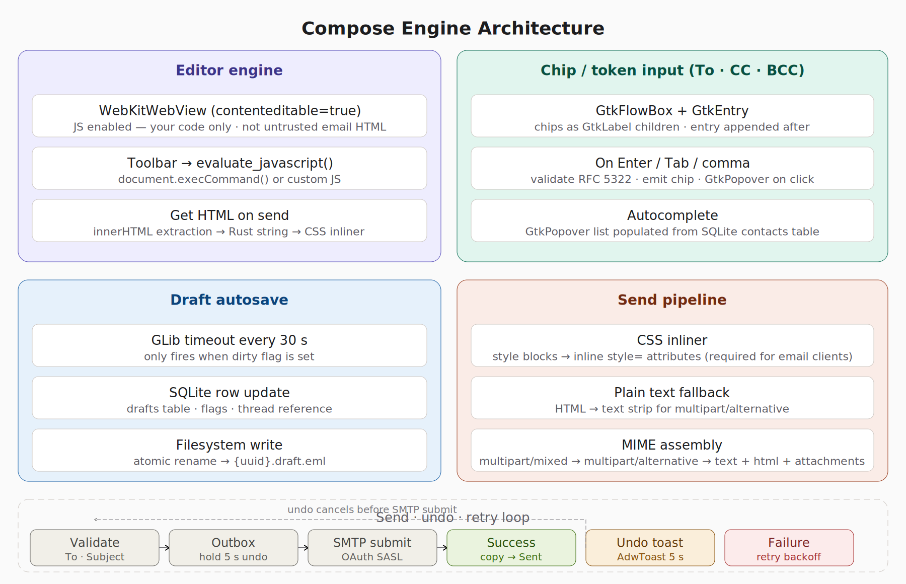
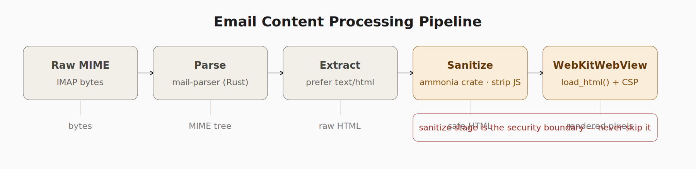

# Epistle — Technical Architecture

**Version:** 0.2 (Revised)  
**Status:** Design Phase  
**Stack:** Rust · GTK4 · libadwaita · WebKit2GTK · SQLite · Flatpak  
**Target:** GNOME Circle  
**Last Updated:** 2026-04-08  
**Change Log:** v0.2 — Revised authentication to use GNOME Online Accounts (GOA) as primary path; adopted `async-imap` crate instead of custom IMAP implementation; moved QRESYNC to future optimisation; updated risk table and development phases to reflect revised scope.

---

## Table of Contents

1. [Overview & Guiding Principles](#1-overview--guiding-principles)
2. [Technology Stack](#2-technology-stack)
3. [System Architecture](#3-system-architecture)
4. [Storage Architecture](#4-storage-architecture)
5. [Authentication & IMAP Sync](#5-authentication--imap-sync)
6. [HTML Rendering — WebKitGTK](#6-html-rendering--webkitgtk)
7. [Compose Engine](#7-compose-engine)
8. [Email Processing Pipeline](#8-email-processing-pipeline)
9. [Threading & Conversation Model](#9-threading--conversation-model)
10. [UI Architecture](#10-ui-architecture)
11. [Security Architecture](#11-security-architecture)
12. [Key Technical Risks](#12-key-technical-risks)
13. [Development Phases](#13-development-phases)

---

## 1. Overview & Guiding Principles

Epistle is a native email client for the GNOME desktop, targeting GNOME Circle. It is designed around three core convictions:

**Email is conversations, not a queue of documents.** The UI is built around conversation threading as the primary model. Individual messages are nodes in a thread; the thread is the atomic unit of navigation, action, and search.

**Native-first, browser where necessary.** The overwhelming majority of the UI is GTK4 native — sidebar, navigation, message list, chip input, toolbars. WebKitGTK is used surgically: for rendering received HTML email bodies and for the compose editor surface, where a browser engine is genuinely necessary. Everywhere else is GTK4.

**Offline-first with clean sync.** Every message is stored locally on first download. The app is fully functional with no network connection. Sync is incremental and efficient, using IMAP QRESYNC and UID-based tracking to download only what has changed.

---

## 2. Technology Stack

| Layer | Technology | Rationale |
|---|---|---|
| Language | Rust | Memory safety, async ecosystem, gtk4-rs bindings |
| UI toolkit | GTK4 + libadwaita | GNOME Circle requirement; adaptive layout |
| Rendering | WebKit2GTK (webkit6 crate) | Only viable option for correct HTML email rendering |
| Storage | SQLite 3 (`sqlx`) | Async connection pool, built-in migrations, FTS5 for full-text search; same approach as Moments |
| Credentials | libsecret | GNOME Keyring integration; already in Moments |
| Build | Meson + Flatpak | Standard GNOME app toolchain |
| IMAP | `async-imap` crate | IMAP4rev1 + IDLE, CONDSTORE; QRESYNC deferred to post-v1 |
| SMTP | `lettre` | Async SMTP client with TLS, XOAUTH2 SASL (GOA providers), PLAIN (generic IMAP) |
| Auth | GNOME Online Accounts (GOA) | Account discovery, OAuth token management, password retrieval via D-Bus |

---

## 3. System Architecture


*[DIAGRAM PENDING UPDATE — predates v0.2 GOA/async-imap revisions. See §3 text description for current architecture.]*

The system has four logical layers:

**Sync Engine** — A background Rust service built on the `async-imap` crate that maintains IMAP connections, polls via IMAP IDLE, and writes downloaded messages atomically to the storage layer. Authentication tokens and passwords are retrieved from GNOME Online Accounts (GOA) via D-Bus — the sync engine does not manage OAuth token lifecycles directly. It communicates with the UI layer via GLib signals and channels; it never blocks the GTK main loop.

**Storage Layer** — A deliberate split between SQLite (metadata, search index, sync state) and the filesystem (raw MIME files). Credentials are kept entirely outside the sandbox in GNOME Keyring, accessed via the libsecret D-Bus portal.

**UI Layer** — GTK4 native widgets for all navigation, chrome, and compose controls. WebKitWebView instances for message body rendering and the compose editor surface only.

**GNOME System APIs** — The app integrates with GNOME Online Accounts via D-Bus (account discovery, OAuth token retrieval, password retrieval), Evolution Data Server via `libebook` (contact autocomplete and "Add to Contacts"), system notifications, and Flatpak portals (file picker, keyring access). GOA is the primary authentication path — the app does not implement its own OAuth flows for supported providers (Gmail, Microsoft 365). Generic IMAP accounts are also configured through GOA, which supports Mail Autoconfig XML (added in GNOME 50) for automatic server discovery.

**Contact Autocomplete Model** — Autocomplete draws from two sources: (1) Evolution Data Server address books, accessed via D-Bus (`org.gnome.evolution.dataserver.AddressBook`) using `zbus`, which provides contacts from all configured address books (Google, Microsoft, local), and (2) a local `recent_addresses` table that tracks email addresses the user has sent to but which are not saved contacts. Results are deduplicated by email address at the application level before display — this handles both cross-address-book duplicates from EDS and overlaps between EDS contacts and recent addresses. EDS contacts rank higher in autocomplete results. Users can promote a recent address to a full contact via an "Add to Contacts" action, which pushes a VCard to EDS — EDS syncs upstream to Google Contacts, Microsoft, etc.

**Background & Network** — The app registers with the `org.freedesktop.portal.Background` portal to keep the sync engine running when the window is closed, enabling continuous IMAP IDLE and new mail notifications. It subscribes to NetworkManager D-Bus signals to detect online/offline transitions and adjust sync behaviour immediately rather than relying on connection timeout and retry.

**Desktop Integration** — The app registers as the `x-scheme-handler/mailto` handler, enabling compose-from-link across the desktop. It implements `org.gnome.Shell.SearchProvider2` for system-wide email search. It is D-Bus activatable for single-instance launch, search provider activation, and notification deep linking.

---

## 4. Storage Architecture


*[DIAGRAM PENDING UPDATE — predates UUID naming and hash-sharded storage. See §4 text description for current layout.]*

### 4.1 Why SQLite + Filesystem, not SQLite-only

SQLite performs well on small rows. A typical HTML email with inline images can be 2–5 MB. Storing large MIME blobs in SQLite degrades page cache performance, slows WAL checkpointing, and makes `VACUUM` operations extremely slow on large mailboxes. The filesystem is designed for large binary objects; SQLite is designed for structured queries. Each is used for what it does best.

### 4.2 SQLite Schema (mail.db)

| Table | Purpose | Key columns |
|---|---|---|
| `messages` | One row per message | `id` (UUID), `uid`, `account_id`, `folder_id`, `subject`, `from_addr`, `date`, `flags`, `thread_id`, `mime_path`, `preview` |
| `threads` | Conversation grouping | `thread_id`, `subject_normalised`, `participant_ids`, `last_date`, `unread_count` |
| `folders` | IMAP folder hierarchy | `folder_id`, `account_id`, `name`, `role`, `uidvalidity`, `uidnext` |
| `fts5_search` | Full-text search | Virtual table over `from_addr`, `subject`, `body_text` |
| `sync_state` | IMAP sync checkpoint | `folder_id`, `highest_uid`, `highest_modseq`, `etag` |
| `sync_actions` | Outbound action queue | `id`, `message_id`, `action` (move/flag/delete/send), `params`, `status` (deferred/pending/synced/failed), `created_at` |
| `recent_addresses` | Recently-used email addresses not in EDS | `email`, `display_name`, `use_count` (supplements Folks for autocomplete) |
| `accounts` | Account configuration | `goa_id`, `provider_type`, `email_address`, `imap_host`, `smtp_host` (credentials via GOA, not stored locally) |

### 4.3 Filesystem Layout

```
~/.var/app/io.github.{name}.Mail/data/
├── mail.db                          ← SQLite database
└── messages/
    ├── {account-uuid-1}/
    │   ├── a1/
    │   │   ├── b2/
    │   │   │   └── a1b2c3d4-e5f6-7890-abcd-1234567890ef.eml
    │   │   └── c3/
    │   │       └── a1c3d4e5-f6g7-8901-bcde-2345678901fg.eml
    │   └── f7/
    │       └── g8/
    │           └── f7g8h9i0-j1k2-3456-efgh-5678901234ij.eml
    └── {account-uuid-2}/
        └── …
```

Files are named by an internally-generated UUID, stored in a two-level hash-sharded directory tree using the first two and next two hex characters of the UUID: `{account}/{xx}/{yy}/{uuid}.eml`. This prevents filesystem performance degradation on large mailboxes — most filesystems slow down when a single directory exceeds ~50k entries. With two levels of sharding (256 x 256 = 65,536 leaf directories), each directory holds at most a few hundred files even for mailboxes with millions of messages.

UUID naming decouples the filesystem from IMAP state entirely — IMAP UIDs are only unique within a folder, so UID-based naming would collide across folders. UUID naming means folder renames, UID validity changes, and folder deletes never require file moves or renames.

The `mime_path` column in `messages` stores a **relative path** from the data directory root: `{account-uuid}/{xx}/{yy}/{uuid}.eml`. The absolute path is resolved at runtime by prepending the runtime-resolved data directory (`~/.var/app/{app-id}/data/messages/`). This ensures the database remains valid if the data directory is relocated (Flatpak app ID change, home directory migration, etc.). All writes use atomic rename: write to `{uuid}.eml.tmp` in the target shard directory, then `rename()` to the final path. The shard directories are created on demand. The SQLite row is only inserted after the rename succeeds — a crash mid-write leaves a recoverable temp file, never a corrupt `.eml`.

The local filesystem is a cache, not the source of truth — IMAP is. If the local database is lost, a full resync from the server reconstructs all state. The `.eml` files avoid re-downloading message content but are not required for recovery.

### 4.4 Sync State & Incremental Fetch

On reconnect, the sync engine uses stored `highest_uid` to issue:

- `UID FETCH {last_uid+1}:* (FLAGS BODY.PEEK[])` — fetch new messages only
- `UID FETCH 1:{last_uid} (FLAGS)` — catch flag changes on existing messages

If the server supports CONDSTORE (tracked via `highest_modseq` in `sync_state`), the flag check is narrowed to `CHANGEDSINCE {modseq}`, reducing bandwidth on large mailboxes. QRESYNC support may be added post-v1 via contribution to the `async-imap` crate or a wrapper layer, but is not required — the UID-based approach matches Geary's sync model and is sufficient for typical mailbox sizes.

---

## 5. Authentication & Account Management

### 5.1 GNOME Online Accounts (GOA) — Primary Auth Path

Account discovery and authentication are delegated to GNOME Online Accounts via the `org.gnome.OnlineAccounts` D-Bus interface. The app does not implement its own OAuth flows for supported providers. This eliminates the need for Google OAuth consent screen verification, redirect URI handling, and token refresh management.

GOA exposes each mail-enabled account as a D-Bus object implementing the `org.gnome.OnlineAccounts.Mail` interface, which provides:

- `EmailAddress` — the user's email address
- `ImapHost`, `ImapUserName`, `ImapUseSsl`, `ImapUseTls` — IMAP connection details
- `SmtpHost`, `SmtpUserName`, `SmtpUseSsl`, `SmtpUseTls` — SMTP connection details

Authentication credentials are retrieved through one of two interfaces, depending on the provider:

| Provider Type | GOA Interface | Method | IMAP Auth Mechanism |
|---|---|---|---|
| Gmail, Microsoft 365 | `org.gnome.OnlineAccounts.OAuth2Based` | `GetAccessToken()` | XOAUTH2 SASL |
| Generic IMAP (Fastmail, self-hosted, etc.) | `org.gnome.OnlineAccounts.PasswordBased` | `GetPassword()` | SASL PLAIN over TLS |

**GNOME 50 Autoconfig:** GOA now supports Mail Autoconfig XML (the Mozilla ISP database protocol). When a user adds a generic IMAP account in GNOME Settings, GOA auto-discovers IMAP/SMTP server details from the email domain — reducing manual configuration to just email address and password for most providers.

**Account lifecycle:** The app listens for GOA D-Bus signals (`AccountAdded`, `AccountRemoved`, `AccountChanged`) to detect when accounts are added, removed, or re-authenticated in GNOME Settings.

### 5.2 IMAP Connection Management

- IMAP client built on the `async-imap` crate (IMAP4rev1 + extensions)
- **IMAP IDLE** for push-like new message notification
- One persistent IDLE connection per account for the active folder; falls back to polling with exponential backoff if IDLE is not supported
- Gmail permits 15 simultaneous IMAP connections per account; Yahoo limits to 5 per IP. The sync engine enforces per-provider connection limits and manages a connection pool accordingly
- All IMAP I/O runs on a dedicated Tokio runtime, never on the GTK main loop
- **QRESYNC** (RFC 7162) is a future optimisation — v1 uses standard UID-based incremental sync, which is sufficient for typical mailbox sizes and matches Geary's approach

---

## 6. HTML Rendering — WebKitGTK


*[DIAGRAM PENDING UPDATE — predates separate WebContext decision. See §6 text description for current security configuration.]*

### 6.1 Placement in the Widget Tree

WebKitWebView slots into the body area of each **expanded** message card in the thread view only. Collapsed message cards are 100% GTK4 native — avatar, sender label, preview text, chevron. No WebView exists when a message is collapsed; instances are created lazily on first expand.

The preview text shown in collapsed headers is extracted from the plain-text MIME part (or from HTML-stripped body text) and displayed as a `GtkLabel` — no WebKit involved.

### 6.2 Security Configuration

The app uses **two separate `WebContext` instances**, created at app startup — one for display, one for compose. This provides defence-in-depth isolation between the two security postures. `WebContext` is a lightweight configuration object (settings, URI handlers, security policies) — it does not spawn renderer processes, so two instances have negligible memory/performance cost.

**Display WebContext** — used by all message body WebViews in the thread view:

```
javascript_enabled = false
allow_universal_access_from_file_urls = false
allow_file_access_from_file_urls = false
enable_plugins = false
```

- External resource loading blocked via a `decide-policy` signal handler that rejects any navigation or resource load request to non-local URIs
- Inline images (CID attachments) served via a custom URI scheme handler registered on this context only
- Content Security Policy injected into every message load: `default-src 'none'; style-src 'unsafe-inline'`

**Compose WebContext** — used by the compose editor WebView:

```
javascript_enabled = true   // required for execCommand() and editor JS
allow_universal_access_from_file_urls = false
allow_file_access_from_file_urls = false
enable_plugins = false
```

- JavaScript enabled but runs only trusted app code (toolbar commands, two-zone management)
- No CID URI scheme handler registered — compose does not need access to inline images from other messages
- External resource loading blocked
- Quoted content in the read-only zone is sanitised through `ammonia` before injection

**Flatpak WebKit sandbox:** WebKit2GTK's multi-process model inside Flatpak requires specific sandbox configuration. The app follows GNOME Web's (`org.gnome.Epiphany`) Flatpak manifest as a reference for WebKit sandbox compatibility. A validation spike is scheduled for Phase 2 to confirm `contenteditable` with JS enabled works correctly inside the Flatpak sandbox on the target WebKit version.

### 6.3 Height Management

A `WebKitWebView` does not auto-size to its content. After each `WEBKIT_LOAD_FINISHED` signal, the app calls:

```rust
webview.evaluate_javascript(
    "document.body.scrollHeight",
    None, None, None,
    |result| {
        let height = result.unwrap().to_double() as i32;
        webview.set_size_request(-1, height);
    }
);
```

This must be implemented from the start; retrofitting it causes layout thrashing.

### 6.4 Lazy Instantiation & Memory

Given WebKit2GTK's multi-process model, each WebView spawns a WPE renderer process. For threads with many messages, keeping all WebViews alive is expensive. The app creates a WebView on first expand and destroys it when a message is re-collapsed if the thread contains more than three expanded messages simultaneously.

---

## 7. Compose Engine



### 7.1 Editor Surface Decision

The compose body uses a `WebKitWebView` with `contenteditable="true"`, not `GtkTextView`. This decision is driven by one specific requirement: **inline expansion of quoted thread history**.

When a user replies, the quoted content from previous messages — which is real rendered HTML — must be visible and interactable below the compose area. `GtkTextView` cannot represent arbitrary HTML; it would reduce quoted content to `>` prefixed plain text. WebKit handles this natively because it is the same rendering engine.

The compose WebView hosts **two zones**:
- Top zone: `contenteditable="true"` — the user's reply area
- Bottom zone: `contenteditable="false"` — the quoted thread history, rendered but not editable

JavaScript **is** enabled in the compose WebView because it runs only the app's own trusted code. Quoted content from previous messages is sanitised through `ammonia` before being injected into the bottom zone, maintaining the security boundary.

### 7.2 Chip / Token Input

The To, CC, and BCC fields are implemented as a custom widget: a `GtkFlowBox` containing chip `GtkLabel` widgets with a `GtkEntry` appended at the end.

- **Enter / Tab / comma** → validate entry text against RFC 5322, create chip, clear entry
- **Backspace on empty entry** → remove last chip
- **Click chip** → `GtkPopover` offering Edit or Remove
- **Autocomplete** → `GtkPopover` with `GtkListBox`, populated from the `contacts` SQLite table ranked by `use_count`

### 7.3 Draft Autosave

A `GLib::timeout_add_seconds(30)` callback fires every 30 seconds. It checks a dirty flag; if content has not changed it does nothing. On a dirty state it extracts HTML from the compose WebView, assembles a partial MIME message, and writes `{uuid}.draft.eml` atomically to disk, then updates the `messages` row with `flag = DRAFT`. The compose header updates "Draft saved HH:MM".

### 7.4 Send Pipeline

1. **Validate** — To field must have at least one valid address; warn if Subject is empty
2. **Outbox** — message moves to Outbox state; a 5-second `AdwToast` offers Undo
3. **CSS inlining** — style blocks are converted to inline `style=` attributes (required; Gmail and Outlook strip `<style>` tags from received HTML)
4. **Plain text fallback** — HTML is stripped to generate the `text/plain` MIME part
5. **MIME assembly** — `multipart/mixed` (if attachments) wrapping `multipart/alternative` containing `text/plain` + `text/html`; headers added: `From`, `To`, `CC`, `Date`, `Message-ID`, `References`, `In-Reply-To`
6. **SMTP submission** — OAuth SASL; on success message is copied to Sent folder; on failure it remains in Outbox and retries with exponential backoff on next reconnect

---

## 8. Email Processing Pipeline



Raw MIME bytes from IMAP are processed through a strict pipeline before any content reaches the screen:

| Stage | Tool | Output |
|---|---|---|
| Parse | `mail-parser` crate | MIME tree |
| Extract | custom | HTML body part (or plain text fallback) |
| **Sanitise** | `ammonia` crate | Safe HTML — scripts, unsafe attributes stripped |
| Render | WebKitWebView | Displayed pixels |

The sanitise stage is the security boundary. It runs in the app's Rust process before HTML reaches WebKit. WebKit's security settings (JS disabled, CSP injected) are defence-in-depth, not the primary protection.

For the `fts5_search` table, plain text is extracted from the MIME tree at import time and stored alongside message metadata. Search is a single SQLite `MATCH` query with no external search process.

---

## 9. Threading & Conversation Model

### 9.1 Thread Construction

Threads are constructed from IMAP envelope data using the `References` and `In-Reply-To` headers, following RFC 5256. Messages with matching normalised subjects that lack threading headers are grouped heuristically. The `threads` table maintains a persistent grouping that survives message deletion and folder moves.

### 9.2 Quoted History Policy

**Quoted history is stripped from display by default.** The app detects standard quote patterns (`> ` prefix, `<blockquote>` nesting, Gmail's `gmail_quote` div class) and collapses them with a "Show quoted text" disclosure in each message card. The raw `.eml` is stored untouched; no data is lost.

This decision is justified by the thread view itself: the full history is always visible by expanding earlier message cards. Showing quoted history inside each message body is redundant in a threaded client, degrades rendering performance on long threads, and causes exponential storage growth.

For **forwarding**, the app reconstructs the quoted block explicitly at that moment rather than relying on embedded history.

Users who need inline response (replying between quoted paragraphs) can enable "Include thread history" per-compose, which appends the sanitised quoted block as a read-only tail below the compose zone.

---

## 10. UI Architecture

### 10.1 Layout Model

The app uses `AdwNavigationSplitView` providing a three-pane adaptive layout:

- **Sidebar (210px)** — Unified smart folders (Inbox, Sent, Drafts, Archive, Trash), per-account folder trees, account switcher with pip indicators for multi-account
- **Message list (280px)** — Conversation rows with avatar stacks for multi-participant threads, unread count pills, account pip indicators
- **Content pane (flex)** — Thread view or compose window

The sidebar is collapsible; a ✎ compose icon migrates to the list pane header bar when collapsed, following the same pattern as Apple Mail.

On narrow viewports (< 600px) the split view collapses to a single-pane drill-down automatically via `AdwNavigationSplitView`.

### 10.2 Unified Smart Folders

The sidebar presents a set of unified virtual folders at the top, following the Apple Mail model. These are cross-account views that query all active accounts by folder role:

```
Unified
  ├── Inbox          ← WHERE f.role = 'inbox'    (default view)
  ├── Sent           ← WHERE f.role = 'sent'
  ├── Drafts         ← WHERE f.role = 'drafts'
  ├── Archive        ← WHERE f.role = 'archive'
  └── Trash          ← WHERE f.role = 'trash'
─────────────
Gmail (justin@...)
  ├── Inbox
  ├── Sent
  ├── Drafts
  ├── Archive
  ├── Trash
  └── [custom folders / labels]
Work (justin@work...)
  ├── Inbox
  ├── Sent
  └── ...
```

Unified Inbox is the default view on launch, showing messages from all configured accounts interleaved by date. Per-account folder views are accessible from the sidebar folder tree under each account section. Each message in the unified views carries a small coloured pip on the sender avatar indicating which account it belongs to.

Actions taken in a unified view route to the correct account automatically — archiving a message moves it to that account's archive folder, replying sends from that account's address, etc.

### 10.3 Header Bar

The header bar is divided into three sections aligned with the three panes below. Each section owns contextual actions for its pane: the sidebar section owns the compose button and the sidebar toggle; the list section owns sort and filter; the content section owns per-message actions (archive, delete, reply, forward) and search.

In compose mode the header bar transforms to show Discard, the compose title, and Send.

### 10.4 Full UX Feature Checklist

The following features are required for a complete v1. See `v1_scope.md` for the authoritative scope with full details and out-of-scope rationale.

- [ ] Compose window (bottom panel + expandable to full pane)
- [ ] GOA account discovery (no in-app account setup — users add accounts in GNOME Settings)
- [ ] Empty states for inbox, search, folders
- [ ] Offline / error state banners (`AdwBanner`)
- [ ] Undo archive/delete (`AdwToast`, 5-second deferred sync window)
- [ ] Attachment handling (chips, open, save via Flatpak portal)
- [ ] Search results view with folder origin and highlighted matches
- [ ] Settings (`AdwPreferencesWindow`): accounts, signatures, notifications
- [ ] Keyboard navigation (j/k, e, #, r, a, f, c, /, ? overlay)
- [ ] Adaptive layout (narrow window, Steam Deck)
- [ ] Dark mode (automatic via GTK4/libadwaita)
- [ ] Calendar invite rendering and RSVP (accept/decline/tentative)
- [ ] GNOME Shell search provider
- [ ] `mailto:` URI handler
- [ ] Background Portal for persistent sync

---

## 11. Security Architecture

### 11.1 Threat Model

| Threat | Mitigation |
|---|---|
| Malicious HTML in received email executing code | JS disabled in display WebView; CSP injected; sanitised before load |
| Tracking pixels leaking read status | External resource loading blocked by default; user opt-in per-sender |
| Credential theft | OAuth tokens in GNOME Keyring only; never in SQLite or filesystem |
| Malicious attachment executing on open | Files opened via Flatpak file portal; app never executes attachments directly |
| Quoted content injecting JS into compose WebView | Quoted HTML sanitised through `ammonia` before injection into compose zone |
| IMAP credential interception | TLS required for all connections; certificate validation enforced |

### 11.2 Flatpak Permissions

The app requests the minimum required Flatpak permissions:

```
--share=network                                  ← IMAP/SMTP connections
--socket=wayland
--socket=fallback-x11
--talk-name=org.gnome.OnlineAccounts             ← account discovery, tokens, passwords
--talk-name=org.gnome.evolution.dataserver.*      ← EDS contacts (libebook) + calendar (libecal)
--talk-name=org.gnome.Shell.SearchProvider2       ← system-wide email search
--talk-name=org.freedesktop.NetworkManager        ← online/offline detection
--talk-name=org.freedesktop.portal.Background     ← keep sync running when window closed
--talk-name=org.freedesktop.secrets               ← GNOME Keyring (may not be needed if GOA handles all credentials)
```

---

## 12. Key Technical Risks

| Risk | Severity | Likelihood | Mitigation |
|---|---|---|---|
| GOA D-Bus integration from Rust | Low | Low | Use `zbus` crate; well-documented D-Bus interfaces; spike to validate early |
| WebKit height management causing layout bugs | Medium | High | Implement `evaluate_javascript()` height query from day one |
| GTK5 ABI break (announced, timeline unclear) | Medium | Likely (post-v1) | Do not prematurely abstract; address when GTK5 timeline is clear |
| `async-imap` crate gaps | Low-Medium | Moderate | Crate covers IMAP4rev1 + IDLE + CONDSTORE; extend or PR upstream if gaps found |
| IMAP connection limits triggering provider rate limits | Medium | Moderate | Enforce per-provider connection pool limits in sync engine |
| Compose WebKit contenteditable producing messy HTML | Medium | High | Post-process HTML through DOM normaliser before CSS inlining; proven pattern in Evolution and Geary |
| CSS inlining in Rust | Low-Medium | Moderate | Least mature part of the Rust email ecosystem; evaluate crate options early, fallback to custom implementation |
| Flatpak WebKit sandbox complexity | Medium | Moderate | Follow GNOME Web's sandbox configuration pattern |
| Large mailbox sync performance (100k+ messages) | Low (v1) | Low | UID-based sync is sufficient for v1; QRESYNC added post-v1 if needed |

---

## 13. Development Phases

### Phase 1 — Foundation & Sync (Months 1–3)
GOA D-Bus integration (account discovery, token/password retrieval). IMAP sync engine using `async-imap` with incremental UID-based fetch and IDLE. Background Portal registration to keep sync running when window is closed. NetworkManager D-Bus subscription for online/offline detection. SQLite schema and filesystem storage with atomic writes. SMTP send via GOA credentials. Flatpak build infrastructure (Meson + manifest). Message list with plain text preview (no WebKit yet). Basic three-pane layout with `AdwNavigationSplitView`.

### Phase 2 — Rendering & Threading (Months 3–5)
WebKitGTK integration for message body rendering. HTML sanitisation pipeline (`ammonia`). Thread view with collapsible message cards (collapsed = native GTK, expanded = WebView). Height management via `evaluate_javascript`. CID inline image handling via custom URI scheme. Quoted text detection and collapse. Calendar invite detection and inline rendering (`text/calendar` MIME parts, ICS parsing via `icalendar` crate, RSVP buttons, push accepted events to EDS calendar via `libecal`). Unified inbox across accounts. Sidebar with per-account folder trees. Full-text search (FTS5).

### Phase 3 — Compose & Send (Months 5–7)
Compose window (bottom panel + expanded mode). WebKit `contenteditable` editor with toolbar. Chip input for To/CC/BCC with EDS autocomplete. Quoted thread history (read-only zone). HTML cleanup and CSS inlining. Plain text fallback generation. MIME assembly. Send pipeline with undo toast. Draft autosave. Reply, Reply All, Forward flows.

### Phase 4 — Polish & Release (Months 7–9)
Empty states, error states, offline banner. Keyboard shortcuts (j/k, e, #, r, c, /). Adaptive layout for narrow windows. Settings window (`AdwPreferencesWindow`) with accounts, signatures, notifications. Attachment handling (view, save, add via Flatpak portal). External image blocking with per-message opt-in. System notifications for new mail. GNOME Shell search provider (`org.gnome.Shell.SearchProvider2` via `zbus` — exposes FTS5 email search to system-wide GNOME Shell search). D-Bus activation for single-instance, search provider, and notification deep linking. `mailto:` URI scheme handler for desktop-wide compose-from-link. Flatpak sandbox hardening. CI pipeline and Flathub submission.

See `v1_scope.md` for the complete feature scope and out-of-scope decisions.

---

## Appendix A — Dependency Summary

| Crate | Purpose |
|---|---|
| `gtk4` | GTK4 bindings |
| `libadwaita` | GNOME HIG widgets |
| `webkit6` | WebKit2GTK bindings |
| `sqlx` | SQLite with async connection pool, migrations, FTS5 |
| `zbus` | D-Bus client for GOA integration |
| `async-trait` | Async trait dyn dispatch (same pattern as Moments) |
| `tokio` | Async runtime for sync engine |
| `async-imap` | IMAP client (IMAP4rev1, IDLE, CONDSTORE) |
| `lettre` | SMTP client (async, TLS, XOAUTH2 + PLAIN SASL) |
| `mail-parser` | MIME parsing |
| `ammonia` | HTML sanitisation |
| `icalendar` | ICS/calendar invite parsing |
| `libebook` (via `zbus`) | EDS address book access for contact autocomplete and "Add to Contacts" |
| `glib` | GLib/GObject bindings |
| `gio` | GIO (async I/O, portals) |

---

*This document reflects design decisions reached through iterative architecture review. v0.2 incorporates decisions from risk analysis sessions: GOA as primary auth path, `async-imap` as IMAP foundation, QRESYNC deferred to post-v1. All diagrams are in the `architecture/` directory. Note: diagrams predate v0.2 revisions and may reference the original OAuth/custom IMAP design — they will be updated to reflect the GOA-based architecture.*
